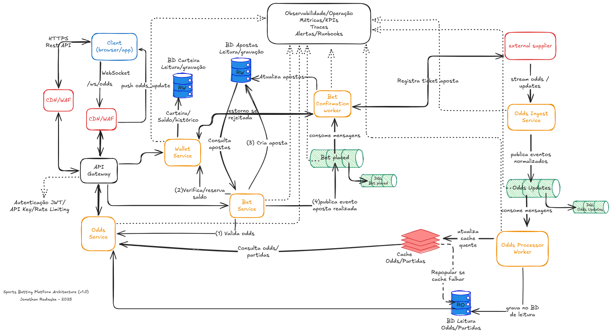

# Sports Bet Platform POC

Plataforma de apostas esportivas (**POC**) escrita em **Go**, inspirada em cenários reais de betting com foco em arquitetura orientada a eventos e consistência de dados.

---

## Objetivo

Demonstrar uma arquitetura moderna de backend distribuído capaz de lidar com **odds em tempo real**, **apostas transacionais** e **processos assíncronos** de confirmação com fornecedores externos.

---

## Serviços Atuais

| Serviço | Descrição | Status |
|----------|------------|--------|
| **odds-ingest-service** | Conecta ao fornecedor externo via WebSocket, normaliza e publica eventos `odds_updates` no Kafka. | ✅ Implementado |
| **odds-processor-worker** | Consome `odds_updates`, atualiza cache e persiste dados em `odds_current` e `odds_history`. | ✅ Implementado |
| **odds-service** | Expõe endpoints REST e WS para clientes consultarem odds e partidas em tempo real. | 🚧 Próximo |
| **wallet-service** | Gerencia saldos, operações de crédito/débito e histórico financeiro. | 🕓 Planejado |
| **bet-service** | Recebe apostas, valida odds, reserva saldo e publica `bet_placed`. | 🕓 Planejado |
| **bet-confirmation-worker** | Processa confirmações de apostas com o fornecedor. | 🕓 Planejado |

---

## Infraestrutura

A infraestrutura local foi montada com **Docker Compose**, incluindo:

- **Postgres** – banco principal (`RW` e `RO`)
- **Redis** – cache quente de odds/partidas
- **Kafka + Zookeeper** – mensageria de eventos (`odds_updates`, `bet_placed`)
- **Prometheus + Grafana** – métricas e dashboards
- **Migrate** – execução automática das migrations

**Comando para subir o ambiente:**

```bash
docker compose up -d
```

---

## Banco de Dados

Migrations automáticas criadas com `golang-migrate`:

```bash
internal/infra/db/sql/pg/migrations/
├── 0001_init_schema.up.sql
└── 0002_odds_read_models.up.sql
```

Tabelas principais:
- `users`, `wallets`, `wallet_ledger`
- `bets`, `bet_transactions`
- `odds_current`, `odds_history`

---

## Observabilidade

Todos os serviços expõem:
- `/metrics` (Prometheus)
- `/healthz` (checagem de dependências)

Portas padrão:
| Serviço | Porta | Endpoint |
|----------|--------|-----------|
| `odds-service` | 9095 | `/metrics`, `/healthz` |
| `odds-processor-worker` | 9097 | `/metrics`, `/healthz` |

---

## Próximos Passos

- Implementar **odds-service** com REST + WebSocket (`/v1/events`, `/v1/odds`, `/ws/odds`)
- Incluir **wallet-service** e **bet-service**
- Expandir observabilidade (dashboards Grafana, alertas Prometheus)

---

## Arquitetura Visual



---

© 2025 — **Jonathan Radieske**  
Sports Betting Platform POC