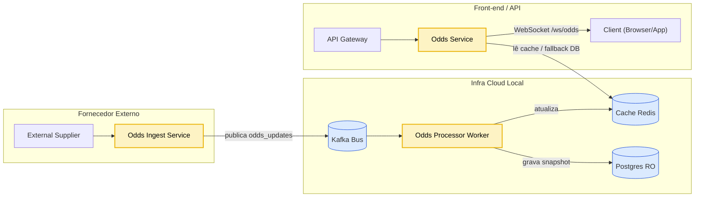

# Arquitetura — Sports Bet Platform POC


Documentação técnica do que está implementado.

---

## Fluxo de Odds em Tempo Real




**Resumo do fluxo**  
1. `supplier-simulator` publica odds via **WebSocket** → `odds-ingest-service`.  
2. `odds-ingest-service` normaliza e publica no **Kafka** (`odds_updates`).  
3. `odds-processor-worker` consome do Kafka, **atualiza Redis** (cache quente) e **persistence snapshots** no **Postgres RO**.  
4. `odds-service` atende **REST/WS** para clientes, lendo do **Redis** com **fallback** para Postgres.

---

## Decisões de Arquitetura

- **Event-driven** para desacoplamento e escalabilidade independente.  
- **Cache-first** no `odds-service` (baixa latência) e **read-optimized DB** para rehidratar.  
- **WS público** somente entre cliente ↔ `odds-service`.  
- **Contracts** compartilhados em `pkg/contracts/events` (ex.: `OddsUpdate`).  
- **Observabilidade**: todos os serviços expõem `/metrics` e `/healthz` (Prometheus-ready).

---

## Migrations (Postgres)

- `V001__init_schema.sql` → users, wallets, bets, ledgers, etc.  
- `V002__odds_read_models.sql` → `odds_current` e `odds_history` (read models).

---

## Serviços (Sprint 2)

- `cmd/supplier-simulator`  
- `cmd/odds-ingest-service`  
- `cmd/odds-processor-worker`  
- `cmd/odds-service`  

---

## Como Subir e Testar

```bash
# 1) Subir infraestrutura base
docker compose up -d

# 2) Executar serviços (atalhos)
make odds
make processor
make ingest
make supplier

# 3) Testar WS
# consulte docs/ws-test.md
```

---

## Próximas Passos

- Wallet Service, Bet Service e Bet Confirmation Worker
- DLQs, retentativas, idempotência e auditoria
- Tracing distribuído e dashboards adicionais