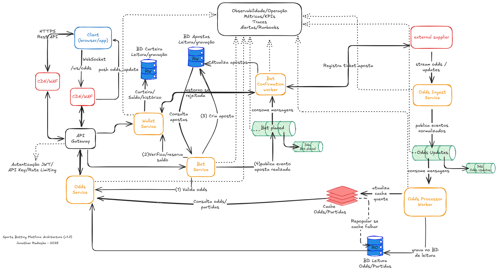
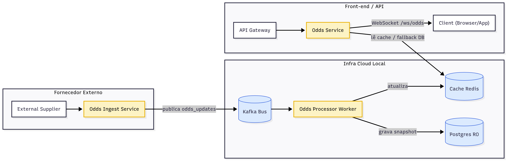

# Arquitetura da Plataforma

Este documento descreve o fluxo técnico e os componentes principais da **Sports Betting Platform POC**, incluindo ingestão, processamento e exposição de odds.

---

## Visão Geral


### Fluxo de Processamento e Entrega de Odds


---

## Fluxo Atual (Sprint 2)

1. **Fornecedor externo** envia stream contínua de partidas e odds.  
2. **Odds Ingest Service** normaliza dados e publica mensagens no Kafka (`odds_updates`).  
3. **Odds Processor Worker** consome, atualiza cache Redis e persiste em `odds_current` e `odds_history`.  
4. Futuramente, o **Odds Service** proverá esses dados via REST e WebSocket.  

---

## Estrutura do Projeto

```bash
sports-bet-platform-poc/
├── build
│   ├── compose
│   │   └── prometheus
│   └── docker
├── cmd
│   ├── api-gateway
│   ├── bet-confirmation-worker
│   ├── bet-service
│   ├── odds-ingest-service
│   ├── odds-processor-worker
│   ├── odds-service
│   ├── supplier-simulator
│   └── wallet-service
├── docs
├── internal
│   ├── infra
│   │   └── db
│   │       └── sql
│   │           └── pg
│   │               └── migrations
│   ├── odds-ingest
│   │   ├── publisher
│   │   └── service
│   ├── odds-processor
│   │   ├── cache
│   │   ├── consumer
│   │   └── repository
│   └── shared
│       ├── cache
│       ├── config
│       ├── db
│       ├── kafka
│       ├── logger
│       └── metrics
└── pkg
    ├── contracts
    │   └── events
    ├── errors
    └── response
└── docker-compose.yml
```

---

## Banco de Dados (resumo)

### Tabelas principais

| Tabela | Propósito |
|---------|------------|
| `users` | Armazena os usuários do sistema |
| `wallets` | Saldo vinculado a cada usuário |
| `wallet_ledger` | Log contábil de transações |
| `bets` | Registro das apostas realizadas |
| `bet_transactions` | Histórico de mudanças de status |
| `odds_current` | Snapshot de odds por evento |
| `odds_history` | Histórico completo de alterações |

---

## Observabilidade

Todos os serviços publicam métricas Prometheus e health checks.  
Dashboards e alertas podem ser configurados no Grafana usando os endpoints `/metrics`.

---

## Próximas Etapas

- Implementar **Odds Service** com REST e WebSocket
- Adicionar **Wallet** e **Bet Service**
- Criar painel Grafana para visualização de métricas

---

Documento: `docs/README-arch.md`  
Autor: **Jonathan Radieske**  
Última atualização: Outubro / 2025